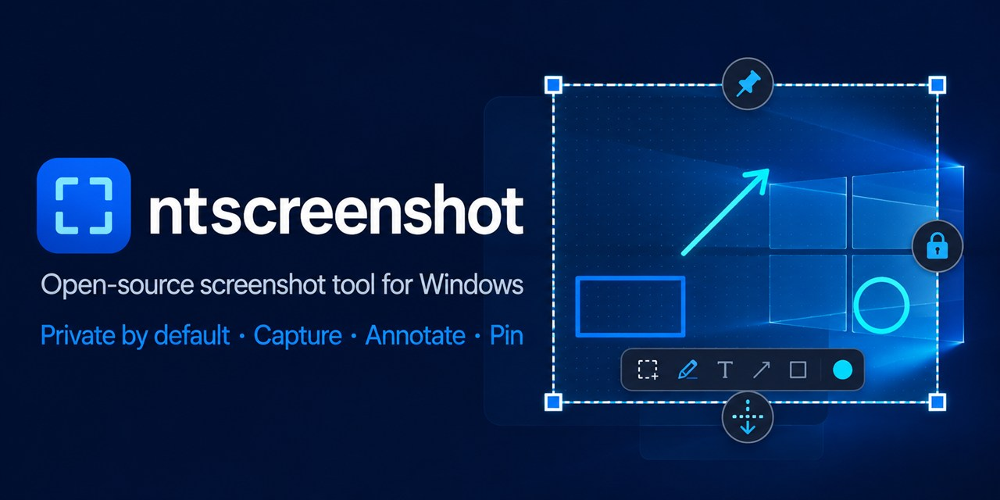
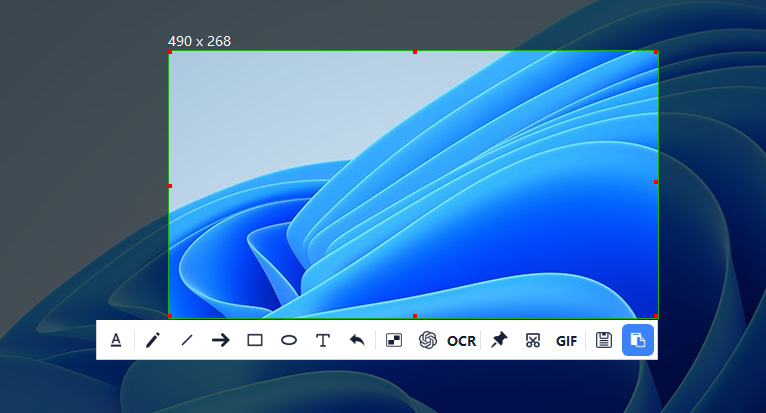
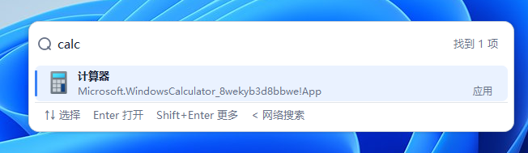
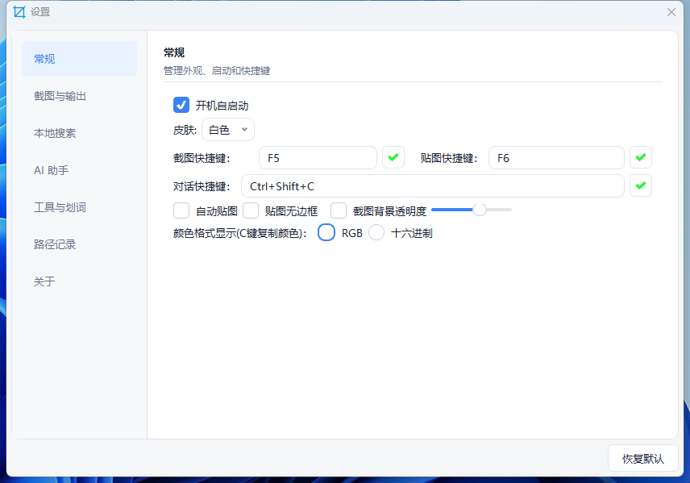
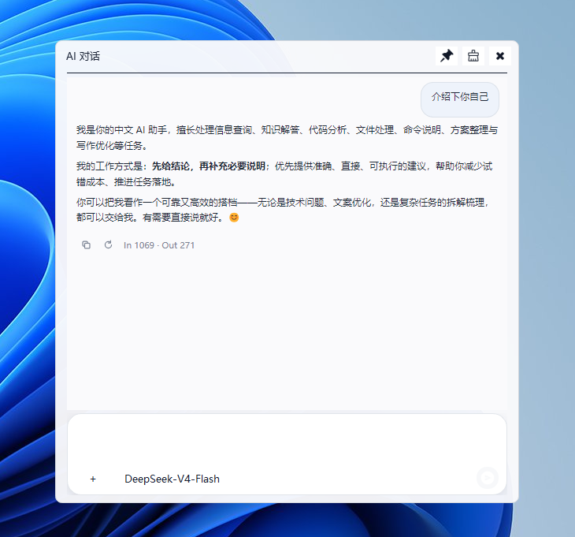

# ntscreenshot

[English](README.en.md)

**Windows 上开源、离线优先的截图与贴图工具。** 选区、标注、贴图、长图和 GIF 录制一步到位；剪贴板历史与本地搜索都在本机完成。AI / OCR 可按需开启，默认不联网。

**[立即下载 Windows 绿色版](https://github.com/tujiaw/ntscreenshot/releases/latest/download/ntscreenshot-x64-Release.zip)** · [查看更新](https://github.com/tujiaw/ntscreenshot/releases/latest) · [常见问题](#faq) · [从源码构建](docs/building.md)

解压 `ntscreenshot-x64-Release.zip`，运行 `ntscreenshot.exe`。无需安装。若 Releases 还没有附件，按 [构建指南](docs/building.md) 自行编译。

## 功能

### 截图与标注

按 `F5` 框选屏幕。窗口吸附、像素级微调、放大镜和取色（`C` 复制颜色）都在选区里完成。

- 画笔、直线、箭头、矩形、椭圆、文字、马赛克、撤销
- 复制、保存、贴图；滚动长截图、GIF 录制
- 识别二维码 / 条码；可选 OCR 和 AI

### 本地搜索

一个输入框搜本机应用、文件、目录和浏览器书签。键盘操作：方向键选择，Enter 打开。

### 贴图与效率

- `F6` 把剪贴板图片钉在桌面上，支持多图和边框
- 本机剪贴板历史
- 划词工具栏：选中文字后出现快捷操作

### 设置

托盘打开设置。开机自启动、浅色 / 深色主题、截图 / 贴图 / 对话快捷键、透明度、取色格式都在这里改。

### AI 助手（可选）

默认关闭。在设置里填入你自己的接口后，用对话快捷键打开。不配密钥则不会联网。

## 30 秒上手

1. 启动后看系统托盘，先打开设置确认快捷键。
2. `F5` 截图：拖选区，用底部工具栏标注，再复制、保存或贴图。
3. `F6` 贴图。
4. OCR 或 AI 只在需要时到设置里打开，用你自己的密钥。

| 快捷键 | 作用 |
| --- | --- |
| `F5` | 截图 |
| `F6` | 贴图 |

快捷键可改。与游戏或其它软件冲突时换一组即可。

## 为什么用它

系统自带截图只能快拷，做不了贴图、长图和本机搜索。商业工具功能全，但往往不开源、要订阅或会上传。ntscreenshot 把这些高频能力放进一个开源托盘应用，数据默认留在你的电脑上。

## 平台

| 平台 | 状态 |
| --- | --- |
| Windows 10 / 11 x64 | 支持 |
| Linux | 暂未提供 |
| macOS | 暂未提供 |

## 常见问题

- 杀毒软件报警、F5 没反应、启动后没有窗口：[FAQ](docs/faq.md)
- OCR / AI / 数据存在哪：[FAQ](docs/faq.md) · [隐私说明](PRIVACY.md)

截图、贴图、剪贴板和本地搜索默认离线。只有你主动配置并调用联网功能时，内容才会发往你指定的服务。详见 [隐私说明](PRIVACY.md)。

## 文档

- [常见问题](docs/faq.md)
- [从源码构建](docs/building.md)
- [文档目录](docs/README.md)
- [更新日志](CHANGELOG.md)

## 参与

欢迎缺陷报告、文档改进和 Pull Request。请先阅读 [贡献指南](CONTRIBUTING.md) 与 [行为准则](CODE_OF_CONDUCT.md)。安全问题按 [安全策略](SECURITY.md) 私下告知。

[Apache License 2.0](LICENSE)。版权见 [NOTICE](NOTICE)，第三方组件见 [THIRD_PARTY_NOTICES.md](THIRD_PARTY_NOTICES.md)。

如果 ntscreenshot 对你有帮助，欢迎点右上角 **Star**。
