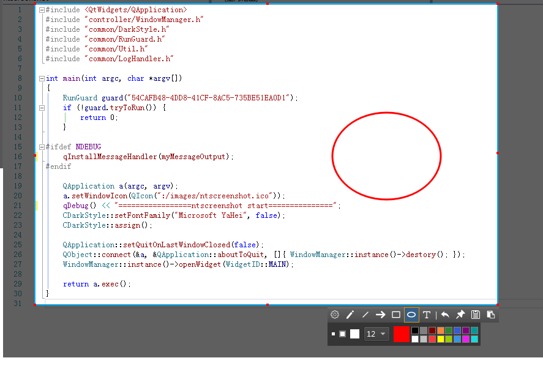
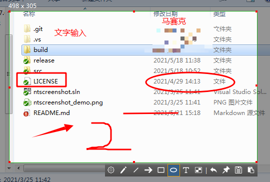

# ntscreenshot

[English](README.en.md)

免费开源的 Windows 截图与桌面效率工具。选区、贴图、标注、长截图、剪贴板历史、本地搜索都在本机完成；AI / OCR 可按需开启，默认不联网。

**[下载 Windows 绿色版](https://github.com/tujiaw/ntscreenshot/releases)** · [常见问题](#faq) · [从源码构建](docs/building.md)

解压 `ntscreenshot-x64-Release.zip` 后运行 `ntscreenshot.exe`，无需安装。若 Releases 中还没有包，可按 [构建指南](docs/building.md) 自行编译。

## 为什么用它

系统自带截图够用，但做不了贴图、长图和标注。商业工具功能完整，却往往不开源、有订阅或上传限制。ntscreenshot 把高频能力放进一个托盘应用，源码与协议公开，数据默认留在你的电脑上。

## 功能

**截图**
- 区域截图、窗口吸附、像素级微调
- 放大镜、取色，`C` 复制当前颜色
- 画笔、箭头、矩形、椭圆、文字、马赛克、撤销
- 滚动长截图、GIF 录制
- 识别二维码 / 条码；可选 OCR

**贴图与效率**
- 贴图、多图管理与边框
- 剪贴板历史（本机数据库）
- 划词工具栏
- 本地文件、目录与浏览器书签搜索

**桌面集成**
- 托盘常驻、全局快捷键、开机自启动
- 深色 / 浅色主题
- 可选 LLM 助手、网页搜索、图床；需在设置中显式开启

## 30 秒上手

1. 启动后看系统托盘。第一次使用可先打开设置，确认快捷键。
2. 按 `F5` 截图：拖动选区，用底部工具栏标注，复制、保存、贴图或滚动截图。
3. 按 `F6` 把剪贴板图片钉在桌面上。
4. 需要 OCR 或 AI 时，到设置里单独打开并填写自己的密钥；不配则这些能力保持关闭。

| 快捷键 | 作用 |
| --- | --- |
| `F5` | 截图 |
| `F6` | 贴图 |

快捷键可在托盘 → 设置中修改。若与游戏或其它软件冲突，换一组即可。

## 平台

| 平台 | 状态 |
| --- | --- |
| Windows 10 / 11 x64 | 支持 |
| Linux | 暂未提供 |
| macOS | 暂未提供 |

## 常见问题

- 杀毒软件报警、F5 没反应、启动后没有窗口：[FAQ](docs/faq.md)
- OCR / AI / 数据存在哪：[FAQ](docs/faq.md) · [隐私说明](PRIVACY.md)

## 隐私

截图、贴图、剪贴板和本地搜索默认离线。只有你主动配置并调用联网功能时，相关文本或图片才会发往你指定的服务。详情见 [隐私说明](PRIVACY.md)。

## 文档

- [常见问题](docs/faq.md)：下载、杀毒软件误报、快捷键、体积、OCR / AI
- [从源码构建](docs/building.md)
- [文档目录](docs/README.md)
- [项目结构](docs/project-structure.md)
- [更新日志](CHANGELOG.md)

## 参与

欢迎缺陷报告、文档改进和 Pull Request。请先阅读 [贡献指南](CONTRIBUTING.md) 与 [行为准则](CODE_OF_CONDUCT.md)。安全问题请按 [安全策略](SECURITY.md) 私下告知，不要发公开 Issue。

## 许可证

[Apache License 2.0](LICENSE)。版权见 [NOTICE](NOTICE)，第三方组件见 [THIRD_PARTY_NOTICES.md](THIRD_PARTY_NOTICES.md)。

如果 ntscreenshot 对你有帮助，欢迎点右上角 **Star**。这是对开源维护最直接的支持。
