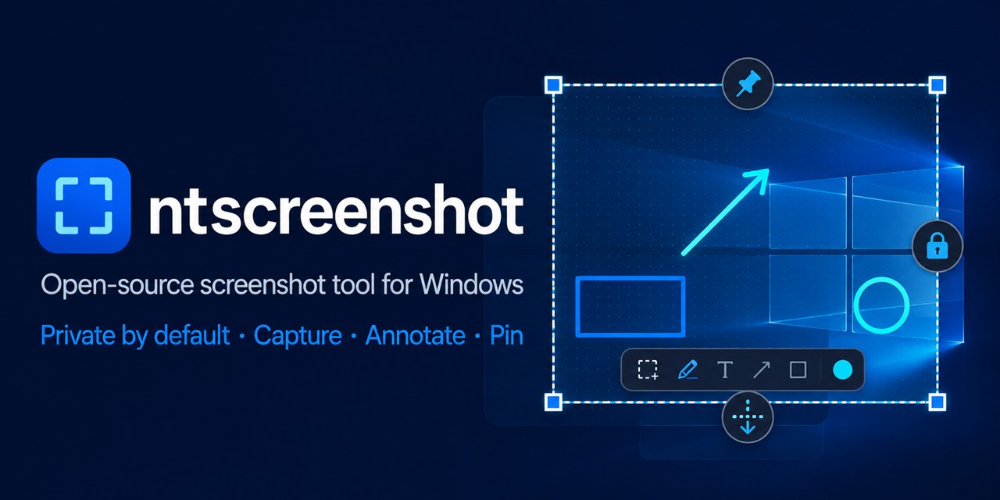
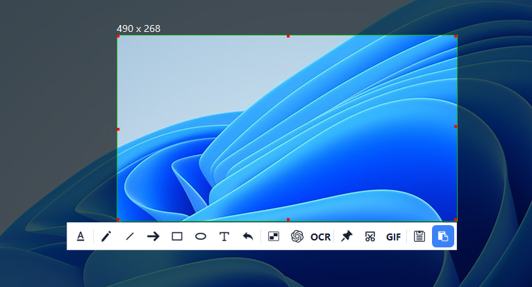
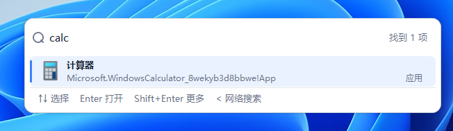
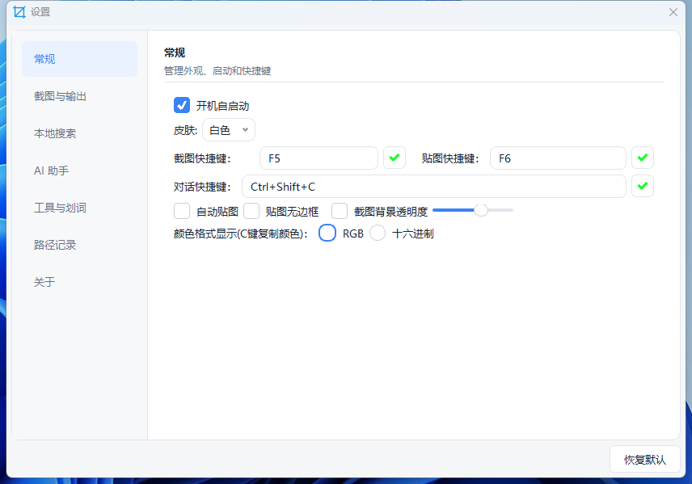

# ntscreenshot

[简体中文](README.zh-CN.md)

**An open-source, privacy-first screenshot and pinning tool for Windows.** Capture, annotate, pin, scroll, and record GIFs in one workflow. Clipboard history and local search stay on your machine; OCR and clipboard AI form filling are opt-in.

**[Download the Windows portable build](https://github.com/tujiaw/ntscreenshot/releases/latest/download/ntscreenshot-x64-Release.zip)** · [What's new](https://github.com/tujiaw/ntscreenshot/releases/latest) · [FAQ](#faq) · [Build from source](docs/building.en.md)

Extract `ntscreenshot-x64-Release.zip` and run `ntscreenshot.exe`. No installer. If a release has no assets yet, follow the [build guide](docs/building.en.md).

## Features

### Capture and annotate

Press `F5` to select a region. Window snapping, pixel-level tweaks, a magnifier, and a color picker (`C` copies the color) stay in the overlay.

- Pen, line, arrow, rectangle, ellipse, text, mosaic, undo
- Copy, save, or pin; scrolling capture and GIF recording
- QR / barcode recognition; optional OCR

### Local search

One box for local apps, files, folders, and browser bookmarks. Arrow keys select, Enter opens.

### Pinning and productivity

- `F6` pins a clipboard image on the desktop, with multi-pin and border options
- Local clipboard history

### Settings

Open Settings from the tray. Startup, light / dark theme, capture / pin hotkeys, overlay opacity, and color format live here. The interface defaults to English; choose English or Chinese under General Settings → Display language, then restart the app.

### AI 对话与划词 / AI chat and text selection

这两项功能已迁移至独立项目 [auto-browser](https://github.com/tujiaw/auto-browser)。截图包不再包含浏览器内核；配置与聊天记录的导入方式见 [迁移说明](docs/ai-migration.md)。

## 30-second start

1. Launch the app, find it in the tray, and confirm hotkeys in Settings.
2. `F5` to capture: drag a region, annotate from the toolbar, then copy, save, or pin.
3. `F6` to pin.
4. Enable OCR only if needed, using your own service credentials.

| Hotkey | Action |
| --- | --- |
| `F5` | Screenshot |
| `F6` | Pin |

Change hotkeys if they clash with a game or another app.

## Why ntscreenshot

The built-in snipping tool is fine for a quick copy. It does not pin images, stitch long pages, or search local files. Commercial tools are polished, but they are often closed-source or subscription-based. ntscreenshot puts the daily workflow in one open-source tray app, and keeps data on your machine by default.

## Platforms

| Platform | Status |
| --- | --- |
| Windows 10 / 11 x64 | Supported |
| Linux | Not available |
| macOS | Not available |

## FAQ

- Antivirus flags, dead hotkeys, no window after launch: [FAQ](docs/faq.en.md)
- OCR / AI / where data lives: [FAQ](docs/faq.en.md) · [Privacy](PRIVACY.en.md)

Capture, pinning, clipboard history, and local search run offline by default. Text or images leave the machine only when you enable and invoke a network feature. See [Privacy](PRIVACY.en.md).

## Docs

- [FAQ](docs/faq.en.md)
- [Build from source](docs/building.en.md)
- [Docs index](docs/README.md)
- [Changelog](CHANGELOG.md)

## Contributing

Bug reports, documentation fixes, and pull requests are welcome. Read [Contributing](CONTRIBUTING.md) and the [Code of Conduct](CODE_OF_CONDUCT.md). Report security issues privately as described in [Security](SECURITY.md).

[Apache License 2.0](LICENSE). Copyright: [NOTICE](NOTICE). Third-party notices: [THIRD_PARTY_NOTICES.md](THIRD_PARTY_NOTICES.md).

If ntscreenshot helps you, a **Star** is the simplest way to support the project.
